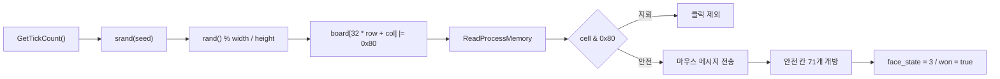

<div align="center">

# Win Minesweeper Hack

**IDA 정적 분석과 런타임 메모리 판독으로 고전 지뢰찾기의 보드 구조를 확인하고 자동 승리를 검증한 프로젝트**


`9 x 9` Beginner 보드에서 지뢰 10개를 판독하고 안전 칸 71개만 자동으로 열어 승리 상태를 확인했다.

</div>

## 프로젝트 개요

이 프로젝트는 제공받은 `winmine.exe`를 수정하지 않고 다음 두 관점으로 분석한다.

1. IDA에서 난수 초기화, 지뢰 배치, 보드 초기화, 클릭 처리와 승리 처리 루틴을 추적한다.
2. 실행 중인 프로세스의 보드 배열을 읽고 지뢰 비트가 없는 칸만 클릭해 분석 결과를 검증한다.

핵심은 지뢰 위치가 전역 보드 배열에 평문 상태로 유지된다는 점이다. 각 칸에서 `0x80` 비트만 검사하면 지뢰 여부를 구분할 수 있다.

## 핵심 분석 결과

| 항목 | 결과 |
|---|---|
| ImageBase | `0x01000000` |
| 보드 시작 주소 | `0x01005340` |
| 보드 접근식 | `board[32 * row + col]` |
| 행 stride | `32 bytes` |
| 지뢰 판정 | `cell & 0x80 != 0` |
| 열린 칸 판정 | `cell & 0x40 != 0` |
| 닫힌 기본 칸 | `0x0F` |
| 닫힌 지뢰 칸 | `0x8F` |
| 승리 후 지뢰 칸 | `0x8E` |

```text
cell = *(uint8_t *)(0x01005340 + 32 * row + col)
```

화면 클릭 좌표는 메시지 처리 루틴에서 확인한 다음 식을 사용한다.

```text
client_x = 16 * col + 4
client_y = 16 * row + 47
```

## 분석 흐름



## 주요 함수

| 주소 | 역할 |
|---|---|
| `0x01003AB0` | `GetTickCount()`와 `srand()`를 이용한 난수 초기화 |
| `0x01003940` | `rand() % n` 난수 래퍼 |
| `0x0100367A` | 새 게임 설정 및 지뢰 배치 |
| `0x01002ED5` | 보드 초기화와 외곽 테두리 설정 |
| `0x01001BC9` | 윈도우 메시지 및 좌표 변환 처리 |
| `0x010037E1` | 클릭 확정 처리 |
| `0x01003008` | 안전 칸 개방과 인접 지뢰 수 계산 |
| `0x0100347C` | 게임 종료 및 승리 상태 처리 |

자세한 분석 내용은 [분석 보고서](docs/analysis-report.md)에서 확인할 수 있다.

## 동적 검증 결과

| 검증 항목 | 값 |
|---|---|
| 난이도 | Beginner |
| 보드 크기 | `9 x 9` |
| 지뢰 수 | `10` |
| 전송한 안전 클릭 | `71` |
| 최종 열린 칸 | `71 / 71` |
| `face_state` | `3` |
| `game_flags` | `0x00000010` |
| 최종 판정 | `won = true` |

원본 검증 데이터는 [dynamic_verification.json](analysis/dynamic_verification.json)에 저장했다.

## 저장소 구조

```text
.
├── README.md
├── docs/
│   └── analysis-report.md
├── analysis/
│   ├── dynamic_verification.json
│   └── winmine_verification.png
├── tools/
│   ├── dynamic_verify_winmine.py
│   ├── ida_collect_board.py
│   ├── ida_collect_winmine.py
│   └── build_report_pdf.py
└── requirements.txt
```

## 재현 방법

### 1. 분석 대상 준비

이 저장소는 원본 실행 파일을 재배포하지 않는다. 정당한 경로로 확보한 대상 파일을 저장소 루트에 `winmine.exe`라는 이름으로 둔다.

스크립트는 실행 전에 다음 SHA256을 검사한다.

```text
D1A612A1791614B628A5C99F03B60FF1B979B8D1F088E99228893CB000C5DAF4
```

해시가 다르면 주소와 자료구조가 일치한다는 보장이 없으므로 실행을 중단한다.

### 2. Python 환경 준비

```powershell
py -3 -m venv .venv
.\.venv\Scripts\Activate.ps1
pip install -r requirements.txt
```

Pillow는 승리 화면 캡처에만 사용된다. 설치되지 않아도 메모리 판독과 자동 클릭은 수행된다.

### 3. 동적 검증

```powershell
python tools\dynamic_verify_winmine.py
```

대상 파일이 다른 위치에 있다면 경로를 인자로 전달한다.

```powershell
python tools\dynamic_verify_winmine.py C:\path\to\winmine.exe
```

실행 후 다음 파일이 생성된다.

- `analysis/dynamic_verification.json`: 초기 지뢰 좌표와 최종 게임 상태
- `analysis/winmine_verification.png`: 자동 클릭 후 승리 화면

### 4. IDA 정적 분석 수집

IDA Professional 9.0에서 자동 분석을 완료한 뒤 제공된 IDAPython 스크립트를 실행한다.

```powershell
$env:WINMINE_ANALYSIS_DIR = "$PWD\analysis"
& "C:\path\to\IDA Professional 9.0\idat64.exe" -A -S"tools\ida_collect_winmine.py" winmine.exe
& "C:\path\to\IDA Professional 9.0\idat64.exe" -A -S"tools\ida_collect_board.py" winmine.exe
```

Hex-Rays 디컴파일러를 사용할 수 없는 환경에서도 디스어셈블리와 참조 정보는 수집할 수 있다.

## 원본 실행 파일을 포함하지 않은 이유

- 분석 대상의 재배포 권한이 명확하지 않다.
- 일부 보안 제품이 오래된 실행 파일을 의심 파일로 분류할 수 있다.
- 정확한 SHA256만 공개해도 동일 바이너리인지 검증할 수 있다.
- 저장소 방문자가 의도하지 않게 실행 파일을 내려받는 상황을 방지할 수 있다.

따라서 `winmine.exe`, IDA 데이터베이스(`*.i64`)와 로컬 임시 파일은 `.gitignore`로 제외했다.

## 범위와 주의사항

- 교육 목적의 로컬 분석 프로젝트다.
- 자동화 스크립트는 위 SHA256과 일치하는 32비트 대상만 지원한다.
- 주소는 해당 PE 이미지의 고정 레이아웃을 기준으로 한다.
- 동적 검증은 격리된 Windows 환경에서 수행하는 것을 권장한다.

## License

분석 및 자동화 코드에는 [MIT License](LICENSE)를 적용한다. 분석 대상 실행 파일 자체는 이 라이선스의 대상이 아니며 저장소에 포함하지 않는다.
